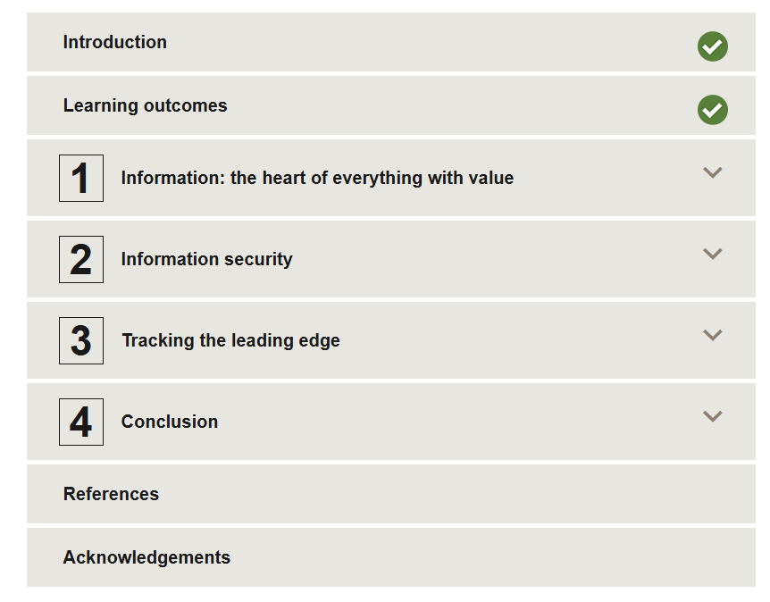

# 🛡️ OpenLearn – Information Security

This repository contains **notes, labs, demos, guides, case studies, cheatsheets, and certificate of completion** for the *OpenLearn – Information Security* program. The course covers essential concepts in **network, system, application security, cryptography, incident response, and overall information protection**.

---

## 📚 Notes
- 📄 [01-introduction.md](./notes/01-introduction.md) – Introduction to Information Security  
- 📄 [02-security-basics.md](./notes/02-security-basics.md) – Security principles and threats  
- 📄 [03-network-security.md](./notes/03-network-security.md) – Network security fundamentals  
- 📄 [04-threats-and-vulnerabilities.md](./notes/04-threats-and-vulnerabilities.md) – Threats and vulnerabilities  
- 📄 [05-system-hardening.md](./notes/05-system-hardening.md) – System hardening techniques  
- 📄 [06-malware-and-attacks.md](./notes/06-malware-and-attacks.md) – Malware and attack types  
- 📄 [07-cryptography.md](./notes/07-cryptography.md) – Cryptography essentials  
- 📄 [08-access-control.md](./notes/08-access-control.md) – Access control methods  
- 📄 [09-monitoring-logging.md](./notes/09-monitoring-logging.md) – Monitoring and logging  
- 📄 [10-incident-response.md](./notes/10-incident-response.md) – Incident response procedures  
- 📄 [11-web-security.md](./notes/11-web-security.md) – Web application security  
- 📄 [12-application-security.md](./notes/12-application-security.md) – Application security best practices  
- 📄 [13-wireless-security.md](./notes/13-wireless-security.md) – Wireless security fundamentals  
- 📄 [14-cloud-security.md](./notes/14-cloud-security.md) – Cloud security essentials  
- 📄 [15-reporting-and-mitigation.md](./notes/15-reporting-and-mitigation.md) – Reporting and mitigation strategies

---

## 🧪 Labs
- 🔧 [red-team-labs.md](./labs/red-team-labs.md) – Offensive security labs  
- 🔧 [blue-team-defense.md](./labs/blue-team-defense.md) – Defensive security labs  
- 🔧 [hands-on-exercises.md](./labs/hands-on-exercises.md) – Practical exercises

---

## 📄 Cheatsheets
- 📑 [network-security.md](./cheatsheets/network-security.md) – Network security quick reference  
- 📑 [system-security.md](./cheatsheets/system-security.md) – System security summary  
- 📑 [web-application-security.md](./cheatsheets/web-application-security.md) – Web security quick guide  
- 📑 [cryptography.md](./cheatsheets/cryptography.md) – Cryptography cheatsheet  
- 📑 [incident-response.md](./cheatsheets/incident-response.md) – Incident response quick reference

---

## 📋 Guides
- 📄 [setup-lab-environment.md](./guides/setup-lab-environment.md) – Lab setup instructions  
- 📄 [incident-response-guidelines.md](./guides/incident-response-guidelines.md) – Incident response best practices  
- 📄 [threat-mitigation-strategies.md](./guides/threat-mitigation-strategies.md) – Threat mitigation strategies

---

## 🔬 Extras
- 📑 [case-studies.md](./extras/case-studies.md) – Analysis of major security incidents  
- 📑 [resources.md](./extras/resources.md) – Additional references and reading materials  
- 📆 [timeline.md](./extras/timeline.md) – Timeline of significant security events

---

## 📖 Docs
- 📘 [index.md](./docs/index.md) – Program overview  
- 📘 [glossary.md](./docs/glossary.md) – Information security glossary  
- 📘 [references.md](./docs/references.md) – External references  
- 📘 [roadmap.md](./docs/roadmap.md) – Learning roadmap  
- 📘 [syllabus.md](./docs/syllabus.md) – Course syllabus

---

## 📸 Screenshots

| Step | Screenshot |
|-------------------------|------------|
| 📚 Course Content |  |
| 🏫 Course Overview |  |
| ⭐ Course Reviews |  |

---

## 📜 Certificate
🎓 [OpenLearn Information Security](./cert/Open%20Learn%20Information%20Security.pdf)

---

## 📝 Personal Review
This program provides a comprehensive foundation in **information security concepts, threat mitigation, cryptography, and practical defense techniques**.  
Hands-on labs, exercises, and cheatsheets help learners understand **network security, system hardening, application security, incident response, and monitoring**.  
It is ideal for anyone seeking practical skills to **secure systems and respond effectively to security incidents**.

---

## ✍️ Author
**Thành Danh** – Red Team Learner & Security Researcher  

- GitHub: [@ngvuthdanhh](https://github.com/ngvuthdanhh)  
- Email: ngvu.thdanh@gmail.com  

---

## 📄 License
This project is licensed under the terms of the **MIT License**. See [LICENSE](./LICENSE) for full details.  
© 2025 ngvuthdanhh. All rights reserved.
